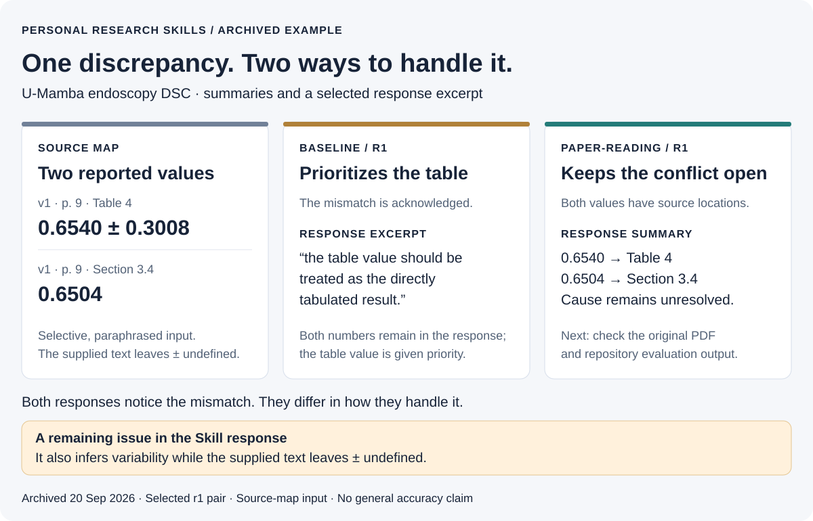

# Personal Research Skills

[](https://github.com/1second1/personal-research-skills/actions/workflows/validate.yml)
[](LICENSE)
[](pyproject.toml)

> Check paper claims, surface evidence conflicts, and turn ideas into testable questions.

`paper-reading` helps an agent examine a paper without silently resolving
conflicting claims or treating an inference as a reported result. The repository
also includes `manuscript-audit`, `research-question`, and `argument-analysis`, plus an optional
Reasoning DNA profile and tools for composing and evaluating research contexts.
It is experimental, not an autonomous paper reader or an automatically learning
agent.

**For authors:** `manuscript-audit` connects a specific manuscript concern to a
deciding check, a bounded repair, and revision recheck. Start with the
[complete synthetic teaching case](evals/cases/manuscript-audit-demo/README.md):
the original run detects overlapping patients and inconsistent reporting;
the revision is actually recomputed and rechecked. Reports are authored examples,
not independent model outputs or proof of Skill superiority.

[中文说明](README.zh-CN.md)

**An archived example:** The U-Mamba [source map](evals/cases/u-mamba-real-paper/source-map.md)
records endoscopy DSC `0.6540` in Table 4 and `0.6504` in Section 3.4, both on
p. 9. Both responses below noticed the discrepancy. The baseline gave the
table value priority; the `paper-reading` response kept its cause unresolved
and proposed checking the original PDF and evaluation output.

[](docs/case-studies/u-mamba-negative-result.md)

The figure summarizes one pair archived on 20 September 2026, using a selective
source map as input. Read the original [baseline](evals/cases/u-mamba-real-paper/comparison-2026-09-20/outputs/baseline-r1.md)
and [Skill](evals/cases/u-mamba-real-paper/comparison-2026-09-20/outputs/skill-r1.md)
responses: the Skill response says `±` is undefined, **but later still infers
variability from it**. This example does not establish a general improvement.
The [nine-run pilot](#60-second-skill-demo) and its limitations are summarized below.

## Install as Agent Skills

To install these Skills into an already working Codex or Claude Code setup,
you need Node.js and `npx`, but no project-specific Python installation or API
key. Your host agent still needs its own model access. Run the installer from
the project where you want the Skills available. Installation uses the open-source
[`skills` CLI](https://github.com/vercel-labs/skills).

Guided installation:

```bash
npx skills add 1second1/personal-research-skills
```

Install all four Skills for both Codex and Claude Code in one command. This
single line works in PowerShell and Bash (do not split it with a Bash `\` in
PowerShell):

```text
npx skills add 1second1/personal-research-skills --skill '*' --agent codex --agent claude-code --copy --yes
```

The verified project-local targets are `.agents/skills/` for Codex and
`.claude/skills/` for Claude Code. Review installed Skills before use because
they run with the permissions granted to the host agent. This repository is not
currently distributed as an official Codex or Claude plugin.

### Available Skills

| Skill | Use it when you need to | Example request |
|---|---|---|
| `paper-reading` | examine a paper's claims, evidence, numbers, limitations, and internal consistency | `Use paper-reading to analyze paper.md without turning inference into fact.` |
| `manuscript-audit` | audit an AI/ML manuscript against supplied code/results and recheck repairs | `Use manuscript-audit to check my draft and results. Locate issues and execute small checks; do not edit the draft yet.` |
| `research-question` | turn a broad research idea into a bounded, falsifiable question | `Use research-question to refine this idea into a testable study.` |
| `argument-analysis` | separate claims, support, warrants, counterarguments, and boundaries in argumentative prose | `Use argument-analysis to audit the reasoning in article.md.` |

In Codex, you can also invoke a Skill explicitly with `$paper-reading`,
`$manuscript-audit`, `$research-question`, or `$argument-analysis`. The host may select a Skill
automatically when the request matches its description.

This installation makes the four Skills available on their own. It does not
automatically load [`profiles/reasoning-dna.yaml`](profiles/reasoning-dna.yaml).
To use that profile, generate a combined context with the
[`research-skills compose` command](#framework-development) and provide the
generated Markdown to your agent. The composer generates context; it does not
call a model.

## 60-second Skill demo

After installing `paper-reading`, copy this prompt and checked excerpt into
Codex or Claude Code. It exercises the standalone Skill; no repository checkout
or PDF parser is needed. The excerpt is taken from the
[U-Mamba source map](evals/cases/u-mamba-real-paper/source-map.md), which
records where these claims appear in the paper.

```text
Use the paper-reading Skill to analyze only the checked excerpt below. Keep
source facts separate from inferences. Report conflicting values with both
locations; do not decide which value is correct without more evidence.

U-Mamba, arXiv:2401.04722v1, endoscopy instrument segmentation:
- p. 9, Table 4: U-Mamba_Bot DSC is 0.6540 +/- 0.3008.
- p. 9, Section 3.4: the prose says the best average DSC is 0.6504.
The excerpt does not define what the +/- values measure.
```

Check that the response preserves both values, cites both locations, and
leaves the meaning of `+/-` unresolved. Output wording may vary. For a longer
example, inspect the archived [Skill-only output](evals/cases/u-mamba-real-paper/comparison-2026-09-20/outputs/skill-r1.md).

The published experiment used the **full source map**, not just this excerpt.
With one model alias and three fresh runs per condition, its scores were:

| Condition | Mean rubric score | What the result showed |
|---|---:|---|
| Baseline task | 6.67 / 10 | Useful summary, but no actionable follow-up under the published rubric |
| `paper-reading` Skill | 9.67 / 10 | Better evidence coverage, fact/inference separation, and next actions |
| Skill + Reasoning DNA | 9.00 / 10 | No incremental gain; all three runs over-interpreted an undefined `±` value |

The profile condition used the composer described below; one-command Skill
installation alone does not reproduce it. This is a nine-run pilot with one
semantic reviewer, not a general benchmark.

[Read the short case study](docs/case-studies/u-mamba-negative-result.md) ·
[inspect all raw outputs and run records](evals/cases/u-mamba-real-paper/comparison-2026-09-20/README.md)

## Why this project exists

Most AI Skills are isolated prompts. This project treats a Skill as a capability with:

- an optional reasoning profile;
- explicit input and output contracts;
- evidence and uncertainty rules;
- examples and regression evaluations;
- a documented boundary.

The first reference profile models a four-layer system:

```text
Identity → Values → Thinking → Workflow → Preferences → Skills
```

Its inquiry pattern is:

```text
What → Why → Assumption → Boundary → Connection → Application → Value
```

## Current status

`v0.2 — Standalone research Skills with optional Reasoning DNA composition`

Included today:

- `profiles/reasoning-dna.yaml`: values, inquiry pattern, decision rules, workflows, and preferences;
- a validated YAML profile loader and Skill composer (PyYAML);
- `paper-reading`: evidence-grounded paper analysis;
- `manuscript-audit`: concrete author-facing checks, repairs and revision recheck;
- `research-question`: conversion of broad ideas into bounded, falsifiable questions;
- `argument-analysis`: claim, support, warrant, counterargument, and boundary analysis for argumentative prose;
- deterministic examples, tests, repository validation, and GitHub Actions;
- a generic structural evaluator with versioned JSON reports and rubrics for all four Skills;
- backward-compatible run-record schemas with SHA-256 artifact verification
  and honest `null` values for provider settings a runtime does not expose;
- deterministic blind-review export with the condition key separated from reviewer files;
- a source-verified [U-Mamba real-paper case](evals/cases/u-mamba-real-paper/README.md) that preserves an internal table/prose conflict instead of hiding it.
- a nine-run [U-Mamba controlled comparison](evals/cases/u-mamba-real-paper/comparison-2026-09-20/README.md)
  with published contexts, raw outputs, integrity records, and a negative
  profile result.

The runtime currently generates a composed execution context. It does not call a model, store private memory, or claim to learn automatically.

This checkout adds claim/evidence matching and uncertainty scope to paper-reading,
plus the executed synthetic audit case and run-record v1.2. No new release tag or
model-quality result is implied. The [three-arm evaluation protocol](evals/cases/manuscript-audit-pilot/preregistration.md)
and [budget proposal](evals/cases/manuscript-audit-pilot/budget-proposal.md) are
prepared before generation; actual evaluation waits for material/model/budget approval.

## Framework development

The commands below are for developing the composer, evaluator, and run-record
tooling. They are not required when you only want to use the installed Skills.
Requirements: Python 3.10 or newer. No API key or private data is required.

```bash
git clone https://github.com/1second1/personal-research-skills.git
cd personal-research-skills
python -m pip install -e .

python -m unittest discover -s tests -v
research-skills validate
research-skills evaluate \
  evals/fixtures/paper-reading-demo/evidence-card.md \
  evals/rubrics/paper-reading.yaml \
  --source evals/fixtures/paper-reading-demo/source.md \
  --format json
```

Compose a Skill with the reference Reasoning DNA profile:

```bash
research-skills compose paper-reading skills/paper-reading/examples/input.md --output context.md
research-skills compose research-question skills/research-question/examples/input.md
research-skills compose argument-analysis skills/argument-analysis/examples/input.md
research-skills list --format json
```

To apply Reasoning DNA to your own text, replace the example input path with a
UTF-8 text or Markdown file, then give the generated `context.md` to your
agent as task context. The default `profile` mode includes both the Skill and
[`profiles/reasoning-dna.yaml`](profiles/reasoning-dna.yaml); `--mode skill`
omits the profile. Neither mode runs a model.

The original `research-skills paper-reading ...` form and
`python scripts/run_skill.py ...` remain backward compatible. Use `-` as the
input path to read from stdin. The CLI emits a
deterministic Markdown context containing the personal profile and selected
Skill contract; `--output` writes it directly as UTF-8 instead of relying on a
shell pipeline. When invoking an installed command outside the checkout, pass
`--root /path/to/personal-research-skills` so it can find the public Skills and
profiles; the wheel intentionally does not duplicate those repository artifacts.

Validate an evaluation run before review:

```bash
research-skills validate --run evals/fixtures/run-record-demo/run.yaml

# Two or more real run records are required.
research-skills blind evals/local/runs/run-a.yaml evals/local/runs/run-b.yaml \
  --seed 20260919 --output evals/local/review-export
```

Give reviewers only `review-manifest.json` and `candidates/`. Keep
`private/review-key.json` hidden until scoring is complete. The bundled run is a
deterministic integrity fixture, not a model result.

## Repository layout

```text
personal-research-skills/
├── profiles/reasoning-dna.yaml
├── research_skills/
│   ├── cli.py
│   ├── dna.py
│   ├── compose.py
│   ├── evaluation.py
│   ├── run_records.py
│   └── blinding.py
├── scripts/                  # backward-compatible wrappers
├── skills/
│   ├── paper-reading/
│   ├── research-question/
│   └── argument-analysis/
├── evals/
├── tests/
├── docs/
├── CHANGELOG.md
└── .github/workflows/validate.yml
```

Every Skill should include:

```text
skills/<skill-name>/
├── SKILL.md
├── contract.yaml
├── examples/
│   ├── input.md
│   └── expected-output.md
└── evals/
    └── pressure-scenarios.md
```

## Design principles

- Evidence is separate from inference.
- Unsupported conclusions are marked instead of invented.
- Conflicting source claims remain visible and traceable.
- Every recommendation has a measurable next action.
- A profile is reusable; a Skill remains independently testable.
- Boundaries are part of the output, not an afterthought.

## Roadmap

For source checks and three-condition experiments, see
[the evaluation protocol](evals/PROTOCOL.md). Passing automated checks does not
establish semantic correctness or demonstrate a benefit from the profile.

The parser/contract layer, generic evaluator, versioned run-record schemas,
blind-review exporter, initial evaluation protocol, and first
[source-verified real-paper case](evals/cases/u-mamba-real-paper/README.md) are
implemented. The real-paper case uncovered and retains a `0.6540` table value
versus `0.6504` prose value conflict; it is a curated reference fixture, not a
model-quality result. Its first repeated comparison found Skill-only above the
baseline (`9.67` versus `6.67` mean rubric score), while Skill + profile scored
`9.00`; the profile therefore showed no incremental gain in this setup. This
was a single-agent best-effort blind review, not an independent human study. A
single-run [argument-analysis pilot](evals/cases/2013-text3-pilot/README.md)
showed a clear benefit from the Skill contract but no measured gain from the
profile over Skill-only. This is evidence from one evaluation setup, not a
general result.

1. Obtain an independent second review of the published real-paper runs and retain disagreements.
2. Add a reviewable, versioned feedback proposal for the observed `±` attribution failure, then rerun the affected case.
3. Add provider-neutral model execution, then PDF, repository, and experiment adapters after the feedback regression.

## Contributing

Read [CONTRIBUTING.md](CONTRIBUTING.md), [the detailed contribution guide](docs/contributing.md), [SECURITY.md](SECURITY.md), [RELEASE.md](RELEASE.md), and [CHANGELOG.md](CHANGELOG.md) before opening a pull request.

Do not commit API keys, private papers, participant data, or unredacted conversation logs.

## License

MIT. See [LICENSE](LICENSE).
