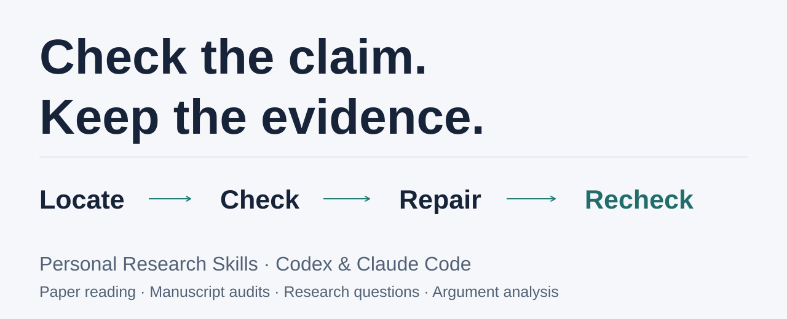

# Personal Research Skills 中文说明

[](docs/quickstart.md#中文试用)

> 有依据地读论文，对照代码与结果审查稿件，把研究想法变成可检验的问题。

四个可独立安装到 **Codex 和 Claude Code** 的科研 Agent Skill。
从手头的论文、AI／机器学习稿件、研究想法或论证文章开始，让 Agent 将主张与证据对应，
保留不确定性，并给出具体的下一步。

[先试一次审查](docs/quickstart.md#中文试用) · [安装](#安装到-codex-和-claude-code) · [审查自己的稿件](#审查自己的稿件) ·
[60 秒论文阅读演示](#60-秒-skill-演示) · [English](README.md)

**v0.3.0 新增稿件审查：** 定位质疑 → 核对证据 → 修复表述或实验 → 复查修订稿。
[完整合成教学案例](evals/cases/manuscript-audit-demo/README.md)保存了实际检查和修复后的较低成绩。
报告是教学示例，不是独立模型评测输出。

这些 Skill 是实验性的研究辅助工具。宿主 Agent 提供模型和工具；可选 Python 框架用于
组合上下文和检查产物，本身不调用模型，也不自动学习。

## 安装到 Codex 和 Claude Code

想先审查 AI／机器学习稿件，可以只安装 `manuscript-audit`：

```text
npx skills add 1second1/personal-research-skills --skill manuscript-audit --agent codex --agent claude-code --copy --yes
```

然后复制[教学摘录与请求](docs/quickstart.md#中文试用)试用，再换成自己的稿件。
需要已能正常使用的宿主 Agent、Node.js 和 `npx`。

若 Codex 或 Claude Code 已能正常调用模型，安装这四个 Skill 不需要为本项目额外安装
Python 或配置 API Key；宿主 Agent 本身仍须具备模型访问能力。安装器需要 Node.js
和 `npx`，使用开源的 [`skills` CLI](https://github.com/vercel-labs/skills)。
请在希望启用这些 Skill 的项目目录中运行：

```bash
npx skills add 1second1/personal-research-skills
```

也可以用以下单行命令把四个 Skill 同时安装到 Codex 和 Claude Code。
PowerShell 和 Bash 都可直接复制；在 PowerShell 中不要用 Bash 的 `\` 拆行：

```text
npx skills add 1second1/personal-research-skills --skill '*' --agent codex --agent claude-code --copy --yes
```

经过实际检测，项目级安装位置分别是 Codex 的 `.agents/skills/` 和 Claude Code 的
`.claude/skills/`。Skill 会继承宿主 Agent 获得的权限，使用前应检查其内容。
本仓库目前不是 Codex 或 Claude 官方插件，不会把普通 GitHub 仓库包装成官方市场项目来宣传。

### 可用 Skills

| Skill | 适用场景 | 示例请求 |
|---|---|---|
| `paper-reading` | 检查论文主张、证据、数值、局限和内部一致性 | `使用 paper-reading 分析 paper.md，不要把推断写成事实。` |
| `manuscript-audit` | 对照论文、代码和结果定位问题，验证质疑并复查修复 | `使用 manuscript-audit 审查我的稿件和结果。定位问题，执行小型检查，先不要修改原稿。` |
| `research-question` | 把宽泛研究想法转化为有边界、可证伪的问题 | `使用 research-question 把这个想法收敛成可验证的研究问题。` |
| `argument-analysis` | 拆分论证中的主张、依据、论证桥梁、反方意见和边界 | `使用 argument-analysis 审查 article.md 的论证结构。` |

在 Codex 中还可以通过 `$paper-reading`、`$manuscript-audit`、`$research-question` 或
`$argument-analysis` 显式调用；当请求与 Skill 描述匹配时，宿主也可能自动选择。

这条安装命令让四个 Skill 可以独立使用，**不会自动加载**
[`profiles/reasoning-dna.yaml`](profiles/reasoning-dna.yaml)。如果要应用个人
Reasoning DNA，需要用下文的 [`research-skills compose`](#框架开发) 生成组合
上下文，再把生成的 Markdown 提供给 Agent。组合器只生成上下文，不调用模型。

## 审查自己的稿件

安装 `manuscript-audit` 后，提供稿件和已有的代码、配置、结果文件，再复制以下请求：

```text
使用 manuscript-audit，对照提供的代码和结果审查 manuscript.md。
定位每项质疑，区分确认错误、证据缺口和可能风险。
执行可行的小型检查，记录哪些已执行、哪些未执行。
给出最小修复，并说明什么证据能够关闭每项问题。
先不要修改原稿。
```

报告按 **Summary → Findings → Checks → Repair Plan → Recheck** 组织。
可以先看[教学报告示例](skills/manuscript-audit/examples/expected-output.md)，或沿
[完整教学案例](evals/cases/manuscript-audit-demo/README.md)查看原稿、修复和复查。
缺失文件按证据限制处理，无法运行的检查保留为未执行。

## 60 秒 Skill 演示

安装 `paper-reading` 后，把下面的请求和已核对的摘录一起复制到 Codex 或
Claude Code。这个例子使用独立 Skill，不需要克隆仓库或解析 PDF。摘录来自
[U-Mamba 来源映射](evals/cases/u-mamba-real-paper/source-map.md)，其中记录了
这些主张在论文中的位置。

```text
使用 paper-reading Skill，只分析下面这段已核对的摘录。区分来源事实和推断；
列出冲突的数值与各自位置；在证据不足时不要判断哪个数值正确。

U-Mamba，arXiv:2401.04722v1，内镜器械分割：
- 第 9 页 Table 4：U-Mamba_Bot 的 DSC 为 0.6540 +/- 0.3008。
- 第 9 页 Section 3.4：正文称最佳平均 DSC 为 0.6504。
摘录没有定义 +/- 后面的数值代表什么。
```

检查回答是否同时保留两个数值、标注两个来源位置，并保持 `+/-` 的含义
未定；具体措辞可能不同。较长的真实输出见
[归档的仅 Skill 运行](evals/cases/u-mamba-real-paper/comparison-2026-09-20/outputs/skill-r1.md)。

仓库中已发布的实验使用**完整来源映射**，不是上面这段短摘录。在同一模型
别名、每组独立运行三次的条件下，评分结果为：

| 条件 | 平均评分 | 本次结果 |
|---|---:|---|
| 基础任务 | 6.67 / 10 | 能完成总结，但按公开评分标准缺少可执行的后续行动 |
| 仅 `paper-reading` Skill | 9.67 / 10 | 证据覆盖、事实与推断分离、后续行动均更完整 |
| Skill + Reasoning DNA | 9.00 / 10 | 没有额外增益；三次运行都过度解释了来源未定义的 `±` |

Profile 条件使用下文的组合器；只安装 Skill 不会复现这一条件。这只是九次
运行、单一语义评审者的小型实验，不是通用基准。

[阅读完整案例文章](docs/case-studies/u-mamba-negative-result.md) ·
[检查全部原始输出与运行记录](evals/cases/u-mamba-real-paper/comparison-2026-09-20/README.md)

<details>
<summary>查看归档回答对照，以及 Skill 对不确定性的错误解释</summary>

U-Mamba 的[来源映射](evals/cases/u-mamba-real-paper/source-map.md)记录了第 9 页两处不同的
内镜 DSC：Table 4 为 `0.6540`，Section 3.4 为 `0.6504`。两份回答都发现了差异。
基础回答优先采用表格值；`paper-reading` 回答保留冲突，没有确定原因，并提出核对
原始 PDF 和仓库评测输出。

[](docs/case-studies/u-mamba-negative-result.md)

图中仅概括 2026 年 9 月 20 日归档的一对回答，输入是选择性改述的来源映射。
可直接查看[基础回答](evals/cases/u-mamba-real-paper/comparison-2026-09-20/outputs/baseline-r1.md)
和 [Skill 回答](evals/cases/u-mamba-real-paper/comparison-2026-09-20/outputs/skill-r1.md)。
Skill 回答虽然注明 `±` 未定义，**后文仍从它推断了变异性**；这个实例不能证明普遍改进。

</details>

## 当前版本

`v0.3.0 — 稿件审查、修复与修订稿复查`

本版范围和限制见 [Release](https://github.com/1second1/personal-research-skills/releases/tag/v0.3.0)
与[更新记录](CHANGELOG.md)。

当前包含：

- `profiles/reasoning-dna.yaml`：Values、Inquiry Pattern、Decision Rules、Workflow 和 Preference；
- 基于 PyYAML 严格校验的 DNA 加载器与 Skill 组合器；
- `paper-reading`：证据导向的论文阅读 Skill；
- `manuscript-audit`：面向作者的具体检查、修复和修订稿复查；
- `research-question`：将宽泛想法转化为有边界、可证伪研究问题的 Skill；
- `argument-analysis`：分析文章、评论和访谈中的主张、依据、隐含前提与边界；
- 示例、自动测试、仓库校验和 GitHub Actions；
- 面向四个 Skill 的通用结构评测器与版本化 JSON 报告；
- 带 SHA-256 完整性校验的 provider-neutral 运行记录 Schema；
- 将盲评候选与 condition 对照表分离的可复现导出工具；
- 首个带来源完整性记录的 [U-Mamba 真实论文案例](evals/cases/u-mamba-real-paper/README.md)，保留表格与正文的数值冲突而不替作者消解。
- 九次运行的 [U-Mamba 三条件对照实验](evals/cases/u-mamba-real-paper/comparison-2026-09-20/README.md)，
  公开上下文、原始输出、完整性记录以及 Profile 未带来增益的负结果。

当前 Runtime 只负责生成组合后的执行上下文，不调用模型、不保存私有记忆，也不声称已经具备自动学习能力。

本版增强了论文主张分类、机制追问和不确定性边界，新增合成审查案例及运行记录 v1.2。
稿件审查规则明确区分未定义统计量与数值巧合、组件必要性与观察到的成功，以及工具限制与
源材料缺失；复查时明确纠正旧报告中的无依据指控，只关闭新证据支持关闭的问题。
这些规则修改不能证明普遍的模型质量提升，也没有给不同审查方法确定最终排名。

归档的[三组比较规则](evals/cases/manuscript-audit-pilot/preregistration.md)与
[预算提案](evals/cases/manuscript-audit-pilot/budget-proposal.md)记录准备工作，不代表后续实验
已完成或已获授权。私有评测包不包含在本版发布中。

## 框架开发

下面的命令用于开发组合器、评测器和运行记录工具；如果只使用已经安装的 Skill，
不需要执行这些步骤。框架开发需要 Python 3.10 或更高版本，不需要 API Key 或私有数据：

```bash
git clone https://github.com/1second1/personal-research-skills.git
cd personal-research-skills
python -m pip install -e .

python -m unittest discover -s tests -v
research-skills validate
research-skills compose paper-reading skills/paper-reading/examples/input.md --output context.md
research-skills compose research-question skills/research-question/examples/input.md
research-skills compose argument-analysis skills/argument-analysis/examples/input.md
research-skills evaluate skills/research-question/examples/expected-output.md evals/rubrics/research-question.yaml --format json
research-skills validate --run evals/fixtures/run-record-demo/run.yaml
```

要把 Reasoning DNA 应用到自己的材料，请把上面 `compose` 命令里的示例输入
路径替换为 UTF-8 文本或 Markdown 文件，再将生成的 `context.md` 交给 Agent
作为任务上下文。默认 `profile` 模式同时包含 Skill 和
[`profiles/reasoning-dna.yaml`](profiles/reasoning-dna.yaml)；`--mode skill`
不包含 Profile。两种模式都不会调用模型。

输入路径写成 `-` 时从 stdin 读取；`--output` 会直接写入 UTF-8 Markdown，
避免依赖 PowerShell 管道传递 Unicode 字符。原有无 `compose` 命令形式和
`scripts/run_skill.py` 仍兼容。
若在仓库目录外运行已安装命令，请传入
`--root /path/to/personal-research-skills`；wheel 不复制公开的 Skill 和 Profile 文件。

真实模型输出应按 `evals/schemas/run-record-v1.1.schema.json` 记录输入、组合上下文、
输出、模型设置和 SHA-256。至少准备两个运行记录后，可用 `research-skills blind`
生成盲评包；只把 `review-manifest.json` 和 `candidates/` 交给评审，评分完成前不要
提供 `private/review-key.json`。运行时没有公开的采样参数应记为 `null`，不能猜测；
旧版 `1.0` 记录仍然兼容。仓库中的 demo 仅用于完整性测试，不是模型成绩。

## 核心模型

```text
Identity → Values → Thinking → Workflow → Preferences → Skills
```

第一版 Inquiry Pattern：

```text
What → Why → Assumption → Boundary → Connection → Application → Value
```

项目不把 Skill 当作孤立 Prompt，而是要求每个 Skill 具备输入输出契约、证据规则、示例、评测和适用边界。

## 后续路线

格式与来源检查、三组对照和人工评分方式见 [评测协议](evals/PROTOCOL.md)。
自动检查通过不等于科研结论正确，目前尚未证明 Profile 有质量增益。

解析与合同传递、通用评测器、运行记录 Schema、盲评导出、初版评测协议以及首个真实论文证据案例已经完成。U-Mamba 案例核实到
Table 4 的 `0.6540` 与正文的 `0.6504` 冲突；它是人工核验的参考夹具，不是模型质量结果。
首轮三条件重复实验中，baseline、仅 Skill、Skill + Profile 的平均分分别为
`6.67`、`9.67`、`9.00`。这说明本次设置下 Skill 有明显作用，但 Profile 没有额外增益；
评审只有一个 Agent，仍需独立人工复核。一次
[论证分析小型实验](evals/cases/2013-text3-pilot/README.md) 显示 Skill 合同有明显作用，
但尚未测出 Reasoning DNA 相比仅 Skill 的独立增益；这只是单次试验，不能推广。

1. 对已发布的真实论文运行进行第二位独立评审并保留分歧；
2. 针对 `±` 被错误解释为标准差的问题建立可审查、可版本化反馈，并回归测试；
3. 在反馈回归后接通用模型执行层，再接 PDF、仓库和实验执行适配器。

## 反馈与分享

[反馈实际使用体验](https://github.com/1second1/personal-research-skills/issues/new?template=usage_feedback.yml) ·
[报告问题](https://github.com/1second1/personal-research-skills/issues/new?template=bug_report.yml) ·
[提出 Skill 建议](https://github.com/1second1/personal-research-skills/issues/new?template=skill_proposal.yml)

欢迎中文或英文反馈，说明哪项任务有帮助、哪里误判或难以使用。只分享公开或合成摘录，
未发表稿件、凭据与参与者数据请保留在本地。
[中英文分享素材](docs/share-kit.md)提供可复制介绍、案例来源和仓库预览图。

英文主说明请阅读 [README.md](README.md)。
