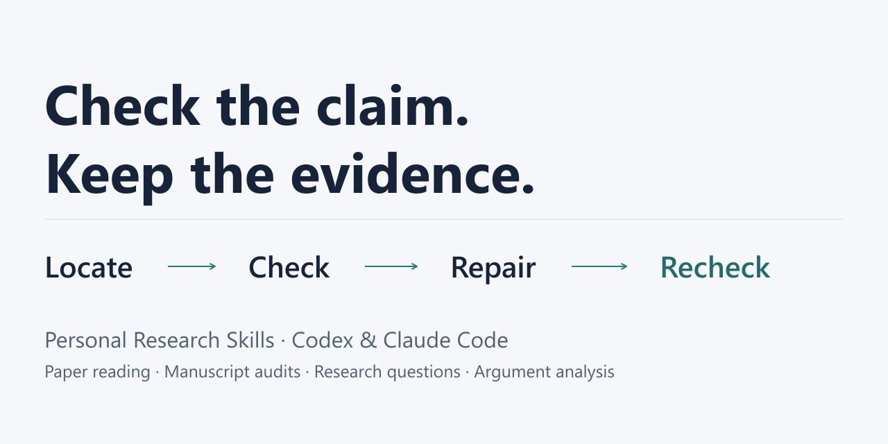

# Share Personal Research Skills

Copy and adapt these drafts when introducing the project. They describe the
public v0.3.0 product and archived teaching case. They have not been posted to
external communities, and they do not claim measured audience growth.

[Try one audit](quickstart.md) · [Repository](https://github.com/1second1/personal-research-skills)

## Short English introduction

**A manuscript audit should leave a checkable trail.**

Personal Research Skills provides four standalone Agent Skills for Codex and
Claude Code: manuscript auditing, paper reading, research questions, and argument
analysis. `manuscript-audit` connects each concern to a source location, deciding
check, execution status, bounded repair, and revision recheck.

The public synthetic case makes this concrete: a manuscript says its patients
are unseen, but all 12 training/test IDs overlap. It reports 0.93 accuracy while
the saved result is 12/12. The revised case has disjoint patients and reports its
actual 4/16 score. The test sets differ, so this is a workflow lesson, not an
estimate of leakage's effect or a performance benchmark.

Try one Skill:

```text
npx skills add 1second1/personal-research-skills --skill manuscript-audit --agent codex --agent claude-code --copy --yes
```

[Copy the teaching request](https://github.com/1second1/personal-research-skills/blob/master/docs/quickstart.md)
and share a useful result or concrete failure. The Skills guide an existing
agent; the optional framework does not call models or learn automatically.

## 中文介绍草稿

**论文审查的价值，是留下可以核对的问题与修复依据。**

Personal Research Skills 提供四个能独立安装到 Codex 和 Claude Code 的科研 Skill：
稿件审查、论文阅读、研究问题收敛、论证分析。其中 `manuscript-audit` 将具体位置、证据、
检查方法、执行情况、最小修复与修订稿复查连起来。

公开合成案例里，稿件称测试患者“此前未见过”，但训练与测试的 12 个 ID 全部重叠；
表格写 `0.93`，保存结果却是 `12/12`。修订后患者不再重叠，稿件如实报告 `4/16`。
两个版本测试集合不同，这不是泄漏影响的因果估计，也不是 Skill 效果基准；它展示的是可追踪的审查流程。

复制上面的命令即可只安装稿件审查 Skill，再用[中文教学请求](quickstart.md#中文试用)试用。
欢迎反馈具体帮助或误判。宿主 Agent 提供模型和工具，仓库框架不调用模型、不自动学习。

项目：https://github.com/1second1/personal-research-skills

## Directory description

Evidence-grounded Agent Skills for Codex and Claude Code: audit AI/ML manuscripts,
read papers, refine research questions, and examine arguments. Includes contracts,
examples, and a synthetic audit-to-recheck walkthrough.

Use this description in relevant directories. Verify their submission rules;
submitting a listing or contacting maintainers is a separate publishing action.

## Repository preview image



[PNG, 1280 × 640](assets/research-skills-social-preview.png) ·
[Editable SVG source](assets/research-skills-overview.svg)

To configure GitHub's social preview, open repository **Settings → General →
Social preview → Edit → Upload an image** and select the PNG. The image is
prepared for this setting; committing it alone does not configure the preview.
GitHub recommends a PNG/JPG/GIF under 1 MB, ideally 1280 × 640.
[Official guidance](https://docs.github.com/en/repositories/managing-your-repositorys-settings-and-features/customizing-your-repository/customizing-your-repositorys-social-media-preview)
